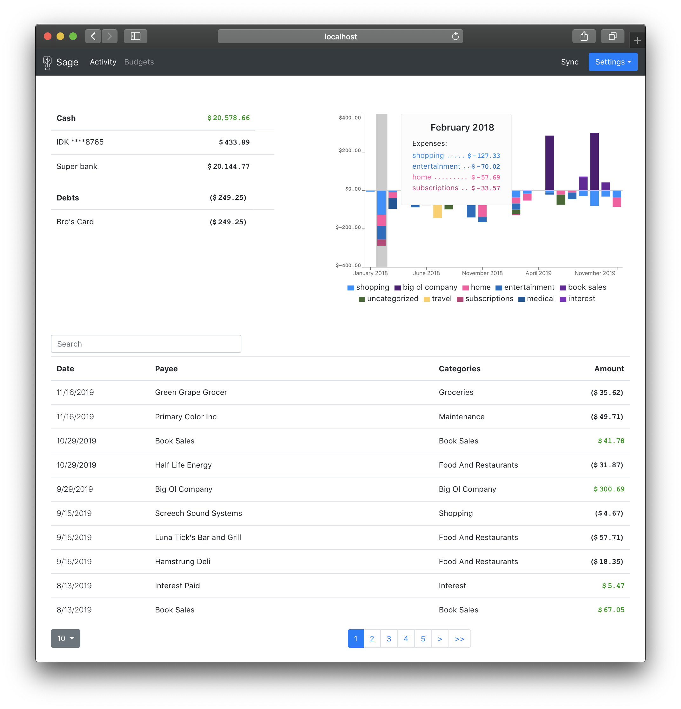

# Sage [](https://travis-ci.com/JohnStarich/sage) [](https://coveralls.io/github/JohnStarich/sage?branch=master)

Be your own accountant, without the stress.

Automatically download transactions from your banks and credit cards, then categorize them based on your own rules.

## Features

* [x] Automatically sync your ledger with banks and credit card institutions
* [x] Securely downloads data directly from your bank or credit card company
* [x] Uses [double-entry bookkeeping][] to keep things in check
* [x] Web UI to view transactions, accounts, and balances
* [x] Web UI to add credentials for new accounts 
* [x] Can deploy as a single binary or as a Docker container



For future features, [see below](#future-work)

[double-entry bookkeeping]: https://en.wikipedia.org/wiki/Double-entry_bookkeeping_system

## Install

Choose **_one_** of the following options:

* Download the app for [Windows][], [Mac][], or [Linux][]
* Run the container image from [Docker Hub](https://hub.docker.com/r/johnstarich/sage):
```bash
DATA_DIR=$HOME/sage
mkdir "$DATA_DIR"
docker run \
    --detach \
    --name sage \
    --publish 127.0.0.1:8080:8080 \
    --volume "$DATA_DIR":/data \
    johnstarich/sage
# Visit http://localhost:8080 in your browser
```
* Download and install the latest Sage server release from the [releases page](https://github.com/JohnStarich/sage/releases/latest) or this script:
```bash
curl -fsSL -H 'Accept: application/vnd.github.v3+json' https://api.github.com/repos/JohnStarich/sage/releases/latest | grep browser_download_url | cut -d '"' -f 4 | grep -i "$(uname -s)-$(uname -m)" | xargs curl -fSL -o sage
chmod +x sage
./sage -help  # Optionally move sage into your PATH
```
* OR download the source and build it: `go get github.com/johnstarich/sage`

[Windows]: https://github.com/JohnStarich/sage/releases/latest/download/Sage-for-Windows.exe
[Mac]: https://github.com/JohnStarich/sage/releases/latest/download/Sage-for-Mac.zip
[Linux]: https://github.com/JohnStarich/sage/releases/latest/download/Sage-for-Linux.deb


## Usage

For available options, run `sage -help`

## Data storage

Sage uses a ledger ([plain text accounting][]) file, a simple JSON-encoded accounts file, and an [`hledger` rules][hledger rules] file.
**You won't need to know about these files to use Sage.** However, if you're a power-user, then these formats may come in handy.

[plain text accounting]: https://plaintextaccounting.org
[hledger rules]: https://hledger.org/csv.html#csv-rules

The ledger will store all of your transactions in plain text so you can easily read it with any text editor. It also supports [several other tools][ledger tools] that can generate reports based on your ledger.

**Warning:** Some banks, like [Bank of America][], may charge a fee for downloading transactions. While this is uncommon, we are not responsible for these charges. Do your homework if you want to be certain these charges won't apply to you.

[Bank of America]: https://wiki.gnucash.org/wiki/OFX_Direct_Connect_Bank_Settings#BofA.2C_CA

The rules file is a format designed by the [hledger][] project for importing CSVs. This file will help Sage automatically categorize incoming transactions into the appropriate accounts for your ledger. After a transaction has been imported, it is assigned an account (category) from this file. To follow convention, only include rules to change the `account2` field or a `comment`. While changing `account1` is supported, it will likely cause problems with Sage since account1 is assumed to be the source institution of the transaction.
Currently, the web UI only supports `account2`.

[hledger]: https://github.com/simonmichael/hledger
[ledger tools]: https://plaintextaccounting.org/#plain-text-accounting-tools

## Future work

* [ ] Budget tracking (maybe add over-budget notifications)
* [ ] Forecasts on current transactions to identify trends
* [ ] Automatic version control to reduce risk of data loss
* [ ] Smarter categorization by training on current ledger

## Awesome libraries 👏

Sage relies on [`aclindsa/ofxgo`](https://github.com/aclindsa/ofxgo) for it's excellent Go implementation of the OFX spec.
